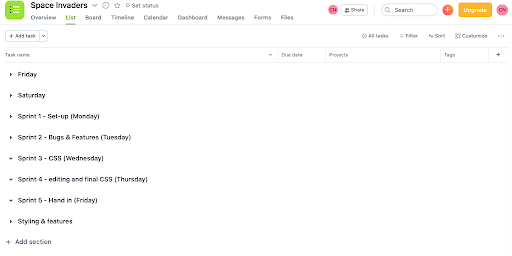
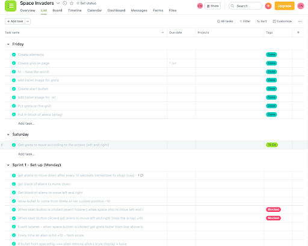

# Save the Planet! - JavaScript Video Game

<h2>Overview </h2>

Save the Planet! is a browser-based arcade style game which was inspired by the book ‘Greta and the Giants’ by Zoe Tucker. It’s an educational game teaching children about the environment. Within the game you need to help Greta throw recycling at the oil giants before they drop pollution on her. The more oil giants you remove, the higher your score and the closer you get to saving the planet! 

This was my first project in the Software Engineering Immersive Course. It was a solo project built in a week and was my first exploration into producing a game in Vanilla JavaScript. 

Visit the game on GitHub pages [here](https://cnmabc.github.io/Project-1/) and the GitHub repo [here](https://github.com/CNMABC/Project-1)


<h2> Brief </h2> 
<ul> 
<li>Grid-based game in the browser</li>
<li>Enable user to move left and right</li>
<li>Design logic for winning and visually displaying score and lives</li>
<li>Design logic for giants to be on timer to move across and down a row on timer</li>
<li>Enable user to shoot with command of certain keys</li>
<li>Design logic for enemies to shoot on a timer</li>
<li>Use JavaScript or jQuery for DOM manipulation</li>
<li>Deploy game online via GitHub pages </li>
<li> Use semantic markup for HTML and CSS</li>
</ul>


<h2>Technologies Used </h2> 
<ul> 
<li>HTML5</li>
<li>CSS</li> 
<li>JavaScript (ES6)</li>
<li>Git & GitHub</li>
<li>Figma</li>
<li>Asana</li>
</ul>


<h2>Approach & Planning Process (timeline)</h2>

As we had 7 days to produce the game, I divided the first 2 days into planning, wireframing and pseudo coding and then divided the remaining 5 into miniature day sprints using the agile scrum methodology to organise it and Asana to visually plan it.You can see below my Asana board where the sprints were created.  


Below you can see that I created labels which I could then tag onto tasks to label their status, these included:  to be started, in progress, blocked or done. This method of agile planning ensured that I stayed on top of all the tasks and I could easily see where my blockers were. 



In the image below, the background is set as a page from the book which the game is based upon. Greta and giants are set on a grid whilst the score is displayed on the left and the levels on the right. Once the start button is pressed the game begins!


<h2>Wins</h2> 
Creating the 3 functions of starting, restarting and end of game had many components within them. It was key to ensure all elements moved in sync but through making sure my code was clean and my variable names were clear I was able to overcome this issue with ease. 

``` javascript
 
 function startGame() {
   addGiants(startingGiantPosition)
   moveGiants()
   oilDripping()
 }
 
 function restartGame (){
   console.log('game restarted')
   removeGiants(currentGiantPosition)
   addGiants(startingGiantPosition)
   removeGreta(currentGretaPosition)
   addGreta(startingGretaPosition)
   clearInterval(giantTimer)
   clearInterval(oilTimer)
 }
 
 function stopGame(){
 console.log('stop the game')
   removeGiants()
   removeGreta()
   removeOil()
   removeTrees()
   clearInterval(giantTimer)
   clearInterval(oilTimer)
   cells.forEach(cell => cell.classList.remove('tree')


```
Then I had to ensure that both Greta and the Giants stayed on the grid and kept moving backwards, forwards and then down. To get this working was a big win as there were many moving parts including a large moveGiants function which involved multiple if statements explaining when the Giants were on the edge of the grid ad if so what action to take. 

``` javascript

function moveGiants() {
   giantTimer = setInterval(() => {// call the function once and it will trigger the interval once (just in case we need to add more logic before or after)
     removeGiants(currentGiantPosition)
     const giantsOnRightEdge = currentGiantPosition.some(giant => giant % width === 9)
     const giantsOnLeftEdge = currentGiantPosition.some(giant => giant % width === 0)
     const giantsOnBottomEdge = currentGiantPosition.some(giant => giantsHitEdge.includes(giant))
     // console.log('giants have hit-->',giantsOnBottomEdge)
     if (giantsOnBottomEdge) {
       restartGame()
       lives -= 1
       livesDisplay.innerText = lives
       return
     }
     if (giantDirection === 'right') {
       if (giantsOnRightEdge) {
         currentGiantPosition = currentGiantPosition.map(giant => giant + width)
         giantDirection = 'left'
       } else { // if they're not on the edge then move them right as normal
         currentGiantPosition = currentGiantPosition.map(giant => giant + 1)
       }
     } else if (giantDirection === 'left') {
       if (giantsOnLeftEdge) {
         currentGiantPosition = currentGiantPosition.map(giant => giant + width)
              giantDirection = 'right'
       } else {
         currentGiantPosition = currentGiantPosition.map(giant => giant - 1)
       }
     } else if (cells[currentGiantPosition].classList.contains('greta')) {
       console.log('checking life')
       if (lives <= 1){
         console.log('game over')
         stopGame()
         return clearInterval(giantTimer)
       } else if (lives >= 1){
         lives -= 1
         livesDisplay.innerText = lives
         console.log('lost a life--->')
         restartGame()
         return clearInterval(giantTimer)
       }
     }
     addGiants(currentGiantPosition)
   },1500)
 }


```
Through the use of gifs for both the oil spill and the recycling shooting this added a simple layer of animation very easily. 


<h2>Challenges</h2>
Ensuring that everything was added to the grid and that all components started to move on loop at the correct speed once the start button function was initiated. Making sure that both Greta and the giants didn’t slip off the grid and making sure when the giants moved down a row, they did not continue to move off the grid. 

Equally, the collision of recycling with oil drips was tricky as there were a few options including collision theory or using .contains, .remove and .filter. which is what I chose. I had to define what the collision was when two items occupied the same space. 

``` javascript

function moveTree() {
   // console.log('current location of tree ---->',startingTreePosition)
   currentTreePosition = currentGretaPosition - width
   addTree(currentTreePosition)
   treesTimer = setInterval(() => {
     if (cells[currentTreePosition].classList.contains('giant')) {
       removeTrees(currentTreePosition)
       score += 100
       scoreDisplay.innerText = score
       console.log('collision')
       cells[currentTreePosition].classList.remove('giant')
       currentGiantPosition = currentGiantPosition.filter(giantPosition => giantPosition !== currentTreePosition)      
       return clearInterval(treesTimer)
     } else if (currentTreePosition - width < 0) {
       removeTrees(currentTreePosition)
       return clearInterval(treesTimer)
     }
     removeTrees(currentTreePosition)
     currentTreePosition -= width // find the new div
     addTree(currentTreePosition)// add the tree again
   }, 500)
 }

```

<h2>Bugs</h2>
After losing a life, random shots from Greta from the previous round sometimes do not disappear and remain on the screen unless you shoot them away. Equally some of the oil drops continue to stay on the screen when the game restarted. In the next round occasionally one shot takes out a whole column of giants. 

<h2>Future Improvements</h2> 
<ul>
<li> The introduction of new levels and between each, the user receives more information about Greta’s quest and lessons on how they can help the environment 
<li> Ability to hit bonus oil giants which increase your score 
<li> At each level introduce a new character of enemy from the oil giants to plastic giants etc. 
<li>Add audio both for a background track and attached to each button and collision </li>
<li>Create a game over </li>
</ul>

<h2>Key Learnings</h2> 
The importance of creating both clearly named variables, concise comments and including console.logs throughout the code, as I had many moving parts including functions, variables and timers I needed to ensure nothing became lost or broken. This then made the code a lot easier to come back to and also fix! 
